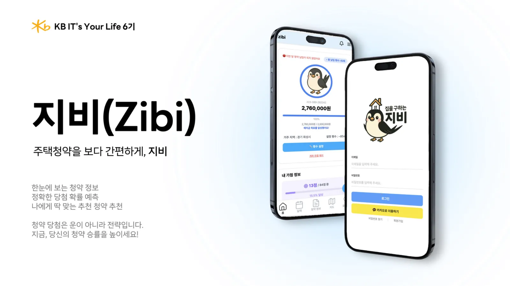

# 🏠 지비(ZIBI) — 청약 정보 웹앱

## 📖 개요
지비(ZIBI)는 청약 정보를 보다 쉽고 편리하게 확인할 수 있도록 만든 **청약 종합 플랫폼**입니다.  

청약 과정은 우리 생각보다 훨씬 복잡하고 준비해야 할 서류·조건이 매우 다양하여 처음 도전하는 사람들에게는 높은 진입장벽이 존재합니다.

이러한 이유로 현재 주택 청약 통장을 보유하고 있는 사람은 2025년 기준 약 2600만명을 넘어서고 있지만, 실제로 청약을 시도해 본 사람의 수치는 현저히 낮습니다.

실제로 저희 부트캠프 내에서 자체적으로 실시한 설문조사에 의하면, 응답자의 약 85%가 청약 통장을 보유하고 있다고 하였지만, 실제로 청약에 도전해 본 사람은 이 중 40%가 채 되지 않았습니다. 

이러한 현상이 발생한 가장 큰 이유가 바로 **"청약에 대해 잘 알지 못해서"**, **"당첨 가능성이 낮을 것 같아서"**, **"청약 신청 절차가 너무 복잡해서**" 이렇게 크게 3가지였습니다.

따라서 저희는 이러한 불편함을 해소하고자, **가점 계산 · 계좌 연동 · 선호 조건에 따른 추천 · 실시간 공고 확인 · 당첨 확률 예측**까지 한 번에 해결할 수 있는 웹앱을 개발했습니다.  

## 🎯 서비스 목표
- **정보 접근성 향상**: 흩어져 있는 청약 정보를 한눈에 모아 확인 가능  
- **개인 맞춤형 기능**: 사용자의 계좌 현황·가점·선호 조건을 반영해 최적의 청약 추천 제공  
- **데이터 기반 의사결정**: 확률 예측 모델을 활용해 당첨 가능성을 시각화  
- **편의성 강화**: 지도/달력/알림/챗봇 기능으로 청약 준비 전 과정을 간편하게 관리  

---

## 📌서비스 소개
- 청약 정보를 한눈에 확인하고 가점 계산·선호 설정·맞춤 추천·계좌 연동·지도/상세 조회까지 제공하는 올인원 웹앱입니다.
- 계좌 연동 및 예치금 현황 시각화(이번 달 납입 여부, 총 납입 횟수, 예치금 달성률)
- 단계형 청약 가점 계산기(쉬운 질문 흐름 · 항목별 점수 미리보기)
- 사용자 선호 기반 맞춤형 청약 추천(지역/평수/가격/유형)
- 청약 목록/상세/즐겨찾기, 당첨 가능성 표시
- 지도에서 청약 단지 확인(마커 클릭 시 하단 카드)
- 즐겨찾기 공고 달력에 일정 표시
- AI 챗봇
- 실시간 알림 기능
- FAQ
- 이메일 가입/인증 + 카카오 로그인
- PWA 지원(오프라인/자동 업데이트)
 
** 모든 기능은 시연 영상에 자세하게 나와있습니다 **

---

## 📽️ 프로젝트 소개

### 🗓️ 프로젝트 기간
- 2025.07 ~ 2025.08

### 👪 팀원 소개
|name|role|position|Github|
|------|---|---|---|
| 정성훈 | 팀장 |프론트엔드 |  |
| 염정우 | 팀원 |프론트엔드 |  |
| 박준영 | 팀원 |프론트엔드 |  |
| 김도현 | 팀원 |백엔드 |  |
| 김지민 | 팀원 |백엔드 |  |
| 유채현 | 팀원 |백엔드 |  |
| 이동욱 | 팀원 |백엔드 |  |

---
## ✨ 기능 설명

<b>계좌 등록 기능</b>

 

<i>메인 페이지에서 실제 청약 계좌를 등록할 수 있습니다.</i>

<i>예치금 충족률에 따라 캐릭터가 바뀌며, 원하는 평수대에 따른 예치금 충족률을 한 눈에 파악할 수 있습니다.</i>

  
  

<b>가점 계산기 기능</b>

 

<i>보다 쉬운 질문들을 통해 가점을 계산할 수 있습니다.</i>

<i>회원가입 때 받은 개인 정보들과, 간단한 6가지의 질문들을 통해 사용자의 가점을 계산할 수 있습니다.</i>

  
  

<b>선호 정보 설정 및 청약 추천 기능</b>

 

<i>사용자가 본인의 선호 정보를 설정하여 그 선호 정보에 맞는 청약을 청약 당첨 확률이 높은 순으로 추천해 줍니다.</i>

  
  

<b>당첨 확률 계산 기능</b>

 

<i>사용자의 계좌 정보, 가점 정보 등을 토대로 각 청약마다의 당첨 확률을 계산하여 제공합니다.</i>

<i>히스토그램과 KNN 모델을 합하여 당첨 확률을 계산하여 보여줍니다.</i>

  

<b>순위 계산 기능</b>

 

<i>특정 청약에 대한 사용자의 순위가 무엇인 지 계산하여 보여줍니다.</i>

  

<b>청약 공고 리스트 보기 기능</b>

 

<i>사용자들은 현재 올라와 있는 모든 청약 공고를 한 눈에 볼 수 있습니다.</i>

<i>특정 청약 공고 자세히 보기 버튼을 누르면, 해당 청약 공고의 평수, 가격, 위치, 즐겨찾기 수, 조회 수, 당첨 확률, 순위 계산, 청약일정, 주변 인프라 정보 등 해당 청약에 관련된 모든 정보들을 볼 수 있습니다.</i>

  
  

<b>지도 기능</b>

 

<i>지도 기능을 통해 현재 올라온 모든 청약 공고에 대한 위치를 바로 알 수 있습니다.</i>

<i>필터 기능을 통해 원하는 지역의 공고를 바로 볼 수 있습니다.</i>

  

<b>달력 기능</b>

 

<i>달력에 즐겨찾기 한 공고들의 청약 공고 일정을 바로 확인할 수 있습니다.</i>

  

<b>즐겨찾기 기능</b>

 

<i>청약 공고를 보며 관심있는 공고에 즐겨찾기를 하여 즐겨찾기 한 공고를 모아 볼 수 있습니다.</i>

  

<b>AI 챗봇 기능</b>

 

<i>AI 챗봇에게 궁금한 것들을 물어볼 수 있습니다.</i>

  

---

## ✨ 최종발표 자료 
<a href = "https://www.miricanvas.com/v2/design2/v/e2dc0509-187e-4430-9705-c7bb7378db64/"> 지비 최종발표 자료 </a>
  
## 📱 시연 영상
<i>(밑 사진 클릭 시 유튜브로 이동)</i>

---
## Etc

Figma

 
  

ERD

 
  

시스템 아키텍처

 
  

